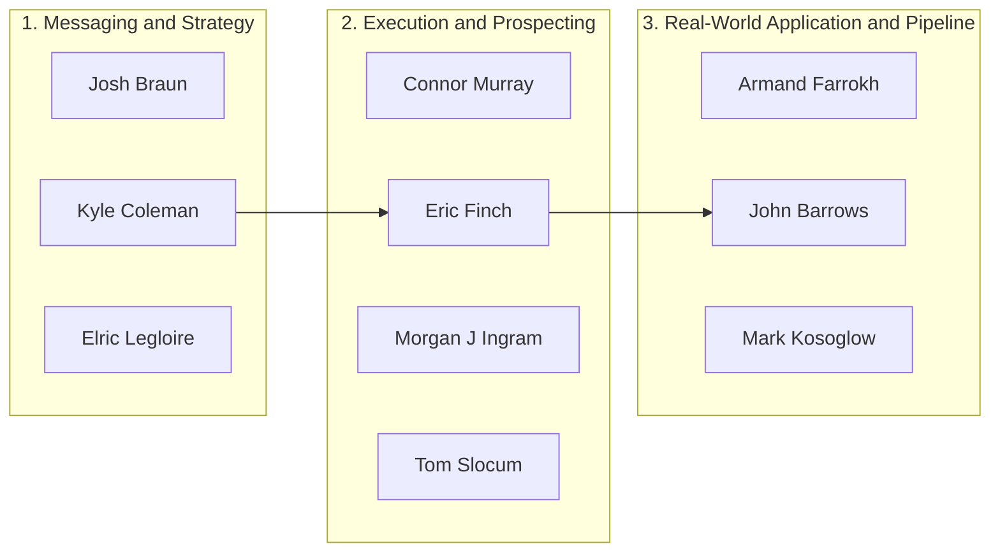

# Cold Outreach Pipeline for B2B SaaS

## Overview

This project documents research on how high-performing practitioners build and execute **cold outreach pipelines** in B2B SaaS.

The focus is on understanding how outreach works in practice—from targeting and messaging to execution and pipeline progression—based on real content from operators.

---

## Selection Criteria

Experts were selected based on:

* Active sharing of **cold outreach tactics** (email, calls, LinkedIn)
* Direct experience building **B2B SaaS pipelines**
* Evidence of **real execution** (live calls, frameworks, case studies)

---

## Expert Grouping by Primary Contribution

These experts are grouped by their **primary contribution to the cold outreach pipeline**—whether they focus on messaging and strategy, hands-on execution, or real-world application and pipeline progression. While many cover multiple areas, each is categorized based on where they provide the most consistent and actionable insights.


### 1. Messaging & Strategy (What to say + how to approach prospects)

* **Josh Braun** → Messaging frameworks and reply-driven outreach
* **Kyle Coleman** → Outbound strategy and positioning from SaaS experience
* **Elric Legloire** → Pipeline design, sequences, and multi-channel strategy

---

### 2. Execution & Prospecting (Cold outreach in practice)

* **Connor Murray** → Full outbound systems (email + calls) with step-by-step execution
* **Eric Finch** → SDR workflows, cold calling, and execution frameworks
* **Morgan J. Ingram** → Prospecting workflows, cold calls, and pipeline conversations
* **Tom Slocum** → Hands-on outbound tactics and pipeline generation

---

### 3. Real-World Application & Pipeline Progression (How it actually plays out)

* **Armand Farrokh** → Live cold calls + expert interviews showing real execution
* **John Barrows** → Full sales process from outreach to closing
* **Mark Kosoglow** → Pipeline progression, deal movement, and revenue execution

---

## Cold Outreach Pipeline Diagram



---

## Key Learnings

* Targeting and messaging matter more than volume
* Simple, relevant outreach outperforms complex personalization
* Cold outreach works best when treated as a conversation, not a pitch
* Consistent execution (follow-ups, systems) drives pipeline results
* Pipeline quality matters more than quantity

---

## Repository Structure
```
/research
  /linkedin-posts       → Collected posts organized by author
  /youtube-transcripts  → Transcripts organized by video
  /other                → Additional materials, PDFs, images
  sources.md            → List of all experts with links and annotations
/scripts
  fetch_youtube.py      → Fetches latest videos from expert YouTube channels
  fetch_extra.py        → Fetches transcripts for additional videos
  fetch_josh_braun.py   → Downloads Josh Braun resource PDFs automatically
  requirements.txt      → Python dependencies
  channels.txt          → List of expert YouTube channel URLs
  extra_videos.txt      → Additional video URLs for transcript fetching
```
---

## Tools Used

* Cursor IDE
* Claude
* ChatGPT 
* YouTube Data API
* Supadata
* GitHub

---

## Notes

This research focuses on **cold outreach as the entry point to pipeline creation**, while acknowledging its connection to broader sales execution and revenue outcomes.
